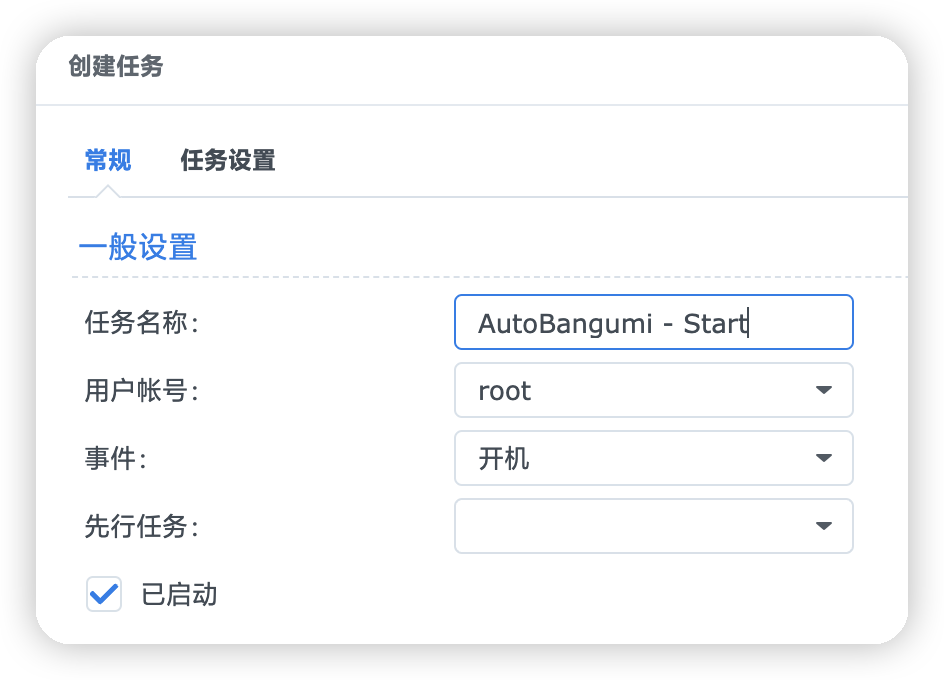
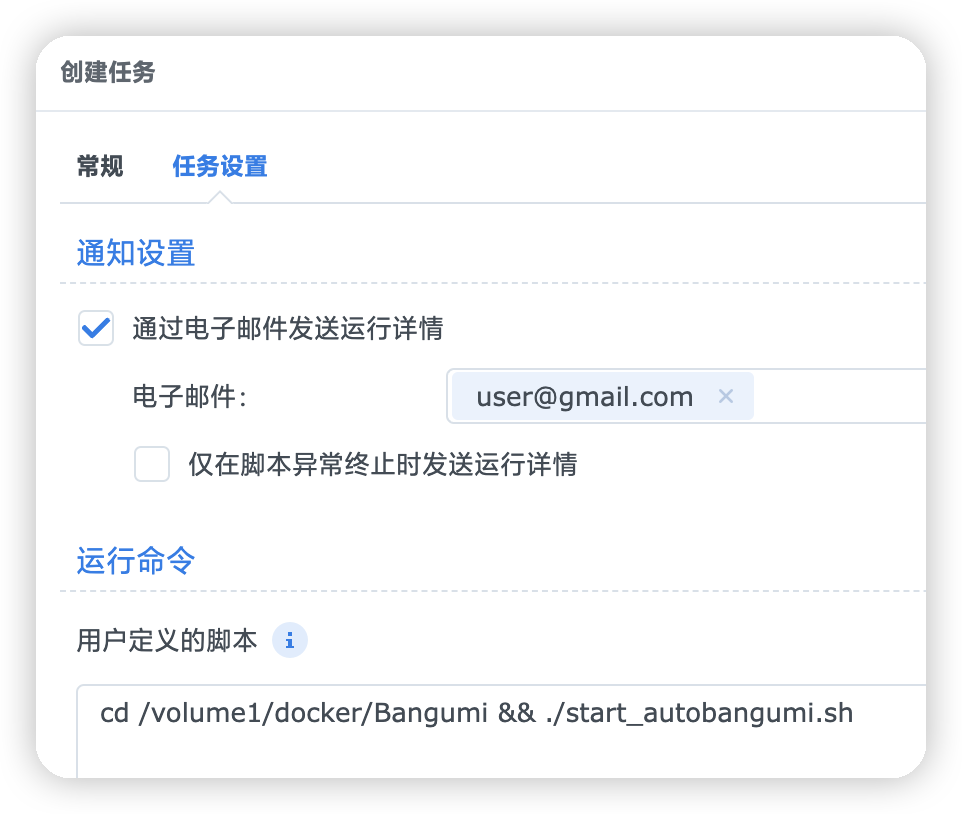

# AutoBangumi-OneClickScrip
一键部署自动追番、控制容器启动顺序及脚本快速更新容器，主要解决开机后qbittorrent启动慢导致AutoBangumi无法访问qbittorrent的问题，项目搭建于群晖，其他平台请根据自身情况修改。

## 依赖
- [Docker Compose](https://github.com/docker/compose)
- [AutoBangumi](https://github.com/EstrellaXD/Auto_Bangumi)
- [qbittorrent](https://registry.hub.docker.com/r/johngong/qbittorrent/)

## 搭建流程
### Docker套件及容器目录
1. 群晖套件中心安装Docker
2. 打开群晖`File Station`，在docker目录下创建文件夹，结构如下：
    ```
    DS918
    ├── docker
    │   └── Bangumi
    │       ├── Autobangumi
    │       │   ├── config
    │       │   └── data
    │       └── qbittorrent
    ├── Download
    └── web
    ```

### Docker Compose
1. 打开群晖`控制面板`>`终端机和SNMP`，勾上`启动SSH功能`的勾，然后点击`应用`
2. 使用SSH客户端连接群晖
3. 使用`sudo -i`切换到root用户
4. 安装Docker Compose：
    ```bash
    sudo curl -L "https://github.com/docker/compose/releases/latest/download/docker-compose-$(uname -s)-$(uname -m)" -o /usr/local/bin/docker-compose
    ```

5. 确保给予该二进制文件执行权限：
    ```bash
    chmod +x /usr/local/bin/docker-compose
    ```

6. 运行以下命令来验证 Docker Compose 是否成功安装：
    ```bash
    docker-compose --version
    ```

7.  将 `/usr/local/bin` 添加到你的系统环境变量中，以便你可以在任何位置运行 `docker-compose` 命令，而不仅仅在 `/usr/local/bin 中`:
    ```bash
    ln -s /usr/local/bin/docker-compose /usr/bin/docker-compose
    ```

### 部署AutoBangumi
在`/volume1/docker/Bangumi`目录下创建Docker Compose配置文件`AutoBangumi.yml`，内容如下：
```yml
#    AutoBangumi-OneClickScrip
#    Deploy with one click for automatic tracking of anime, control container startup sequence, and quickly update containers. It primarily addresses the issue of slow qBittorrent startup after boot, which prevents AutoBangumi from accessing qBittorrent. The project is built on Synology DiskStation (DSM); for other platforms, please make modifications as needed based on your specific situation.
#    Copyright (C) <2023>  <AUKcl>
#
#    This program is free software: you can redistribute it and/or modify
#    it under the terms of the GNU General Public License as published by
#    the Free Software Foundation, either version 3 of the License, or
#    (at your option) any later version.
#
#    This program is distributed in the hope that it will be useful,
#    but WITHOUT ANY WARRANTY; without even the implied warranty of
#    MERCHANTABILITY or FITNESS FOR A PARTICULAR PURPOSE.  See the
#    GNU General Public License for more details.
#
#    You should have received a copy of the GNU General Public License
#    along with this program.  If not, see <https://www.gnu.org/licenses/>.
#    
#    AUKcl's email:kaixuan135@outloook.com

version: '3.2'
services:

  qbittorrent:
    image: johngong/qbittorrent:latest
    container_name: qbittorrent-AutoBangumi
    restart: unless-stopped
    volumes:
      - /volume1/docker/Bangumi/qBittorrent:/config #根据自己的目录修改
    ports:
      - "8989:8989"
    environment:
      - UID=1026
      - GID=100
      - UMASK=000
      - TZ=Asia/Shanghai
      - QB_WEBUI_PORT=8989
      - QB_EE_BIN=false
      - QB_TRACKERS_UPDATE_AUTO=true
      - QB_TRACKERS_LIST_URL=https://raw.githubusercontent.com/ngosang/trackerslist/master/trackers_all.txt

  AutoBangumi:
    image: estrellaxd/auto_bangumi:latest
    container_name: AutoBangumi
    depends_on:
      - qbittorrent
    restart: unless-stopped
    volumes:
      - /volume1/docker/Bangumi/Autobangumi/config:/app/config #根据自己的目录修改
      - /volume1/docker/Bangumi/Autobangumi/data:/app/data #根据自己的目录修改
    ports:
      - "7892:7892"
    environment:
      - TZ=Asia/Shanghai
      - PUID=1026
      - PGID=100
      - UMASK=000
      - AB_DOWNLOADER_HOST=192.168.1.2:8989 #填写qbittorrent的webUI地址，本例中的qbittorrent使用Bridge网络，宿主机IP为192.168.1.2
      - AB_DOWNLOADER_USERNAME=user #填写qbittorrent webUI登陆用户名
      - AB_DOWNLOADER_PASSWORD=password #填写qbittorrent webUI登陆密码
      - AB_INTERVAL_TIME=1800
      - AB_METHOD=Advance
      - AB_GROUP_TAG=True
      - AB_NOT_CONTAIN=720,BIG5,JPTC,繁日双语,内嵌,合集
      - AB_DOWNLOAD_PATH=/Downloads
      - AB_DEBUG_MODE=True
      
```

使用Docker Compose部署AutoBangumi：
```bash
cd /volume1/docker/Bangumi && docker-compose -f AutoBangumi.yml up
```

### 控制AutoBangumi开关机时的容器工作顺序
1. 在`/volume1/docker/Bangumi`目录下创建开机启动脚本`start_autobangumi.sh`，内容如下：
   ```bash
      #    AutoBangumi-OneClickScrip
      #    Deploy with one click for automatic tracking of anime, control container startup sequence, and quickly update containers. It primarily addresses the issue of slow qBittorrent startup after boot, which prevents AutoBangumi from accessing qBittorrent. The project is built on Synology DiskStation (DSM); for other platforms, please make modifications as needed based on your specific situation.
      #    Copyright (C) <2023>  <AUKcl>
      #
      #    This program is free software: you can redistribute it and/or modify
      #    it under the terms of the GNU General Public License as published by
      #    the Free Software Foundation, either version 3 of the License, or
      #    (at your option) any later version.
      #
      #    This program is distributed in the hope that it will be useful,
      #    but WITHOUT ANY WARRANTY; without even the implied warranty of
      #    MERCHANTABILITY or FITNESS FOR A PARTICULAR PURPOSE.  See the
      #    GNU General Public License for more details.
      #
      #    You should have received a copy of the GNU General Public License
      #    along with this program.  If not, see <https://www.gnu.org/licenses/>.
      #    
      #    AUKcl's email:kaixuan135@outloook.com

    #!/bin/bash

    # 定义 Docker Compose 文件的路径
    COMPOSE_FILE="AutoBangumi.yml"

    # 定义 qbittorrent 容器的名称
    QB_CONTAINER="qbittorrent"

    # 定义 autobangumi 容器的名称
    AUTOBANGUMI_CONTAINER="AutoBangumi"

    # 定义用于测试 qbittorrent 可访问性的 URL
    QB_URL="http://localhost:8989"

    # 定义最大重试次数
    MAX_RETRIES=300

    # 定义重试间隔（秒）
    RETRY_INTERVAL=10

    # 检测 qbittorrent 是否可访问的函数
    function is_qbittorrent_accessible() {
    curl --silent --fail $QB_URL > /dev/null
    }

    # 等待 qbittorrent 可访问的函数
    function wait_for_qbittorrent() {
    retries=0
    while ! is_qbittorrent_accessible; do
        retries=$((retries + 1))
        if [ $retries -ge $MAX_RETRIES ]; then
        echo "达到最大重试次数，qbittorrent 无法访问。"
        exit 1
        fi
        echo "等待 qbittorrent 可访问..."
        sleep $RETRY_INTERVAL
    done
    echo "qbittorrent 可访问。"
    }

    # 启动 qbittorrent 服务
    echo "启动 qbittorrent 服务..."
    docker-compose -f $COMPOSE_FILE up -d $QB_CONTAINER

    # 检测 qbittorrent 可访问性
    echo "检测 qbittorrent 可访问性..."
    wait_for_qbittorrent

    # 启动 AutoBangumi 服务
    echo "启动 AutoBangumi 服务..."
    docker-compose -f $COMPOSE_FILE up -d $AUTOBANGUMI_CONTAINER

    echo "AutoBangumi 服务已启动。"
    ```

2. 添加开机脚本，打开群晖`控制面板`>`任务计划`>`新增`>`触发的任务`>`用户自定义的脚本`：
   
   
3. 添加关机脚本，和开机脚本步骤一致，仅仅是事件改为关机，用户自定义的脚本如下：
   ```bash
   cd /volume1/docker/Bangumi && docker-compose -f AutoBangumi.yml stop
   ```

### 设置AutoBangumi.yml的容器定时更新
1. 在`/volume1/docker/Bangumi`目录下创建更新脚本`update_autobangumi_containers.sh`，内容如下：
   ```bash
      #    AutoBangumi-OneClickScrip
      #    Deploy with one click for automatic tracking of anime, control container startup sequence, and quickly update containers. It primarily addresses the issue of slow qBittorrent startup after boot, which prevents AutoBangumi from accessing qBittorrent. The project is built on Synology DiskStation (DSM); for other platforms, please make modifications as needed based on your specific situation.
      #    Copyright (C) <2023>  <AUKcl>
      #
      #    This program is free software: you can redistribute it and/or modify
      #    it under the terms of the GNU General Public License as published by
      #    the Free Software Foundation, either version 3 of the License, or
      #    (at your option) any later version.
      #
      #    This program is distributed in the hope that it will be useful,
      #    but WITHOUT ANY WARRANTY; without even the implied warranty of
      #    MERCHANTABILITY or FITNESS FOR A PARTICULAR PURPOSE.  See the
      #    GNU General Public License for more details.
      #
      #    You should have received a copy of the GNU General Public License
      #    along with this program.  If not, see <https://www.gnu.org/licenses/>.
      #    
      #    AUKcl's email:kaixuan135@outloook.com

      #!/bin/bash

      # 定义要更新的 Docker Compose 文件的路径
      COMPOSE_FILE="AutoBangumi.yml"

      echo "Step 1: 停止容器"
      # 停止容器
      docker-compose -f $COMPOSE_FILE stop

      echo "Step 2: 拉取最新容器镜像"
      # 拉取最新容器镜像
      docker-compose -f $COMPOSE_FILE pull

      echo "Step 3: 重新启动容器"
      # 重新启动容器
      ./start_autobangumi.sh

      echo "容器已更新。"
    ```

2. 添加定时更新脚本，和前面添加开关机脚本基本一致，`触发的任务`改为`计划的任务`,选项多了一个`计划`，示例如下：
   

## End
部署和控制到此结束，至于qbittorrent和AutoBangumi怎么使用我就不赘述了，具体可以查看官方文档；

## 许可证
GPLv3 © [AUKcl](LICENSE)