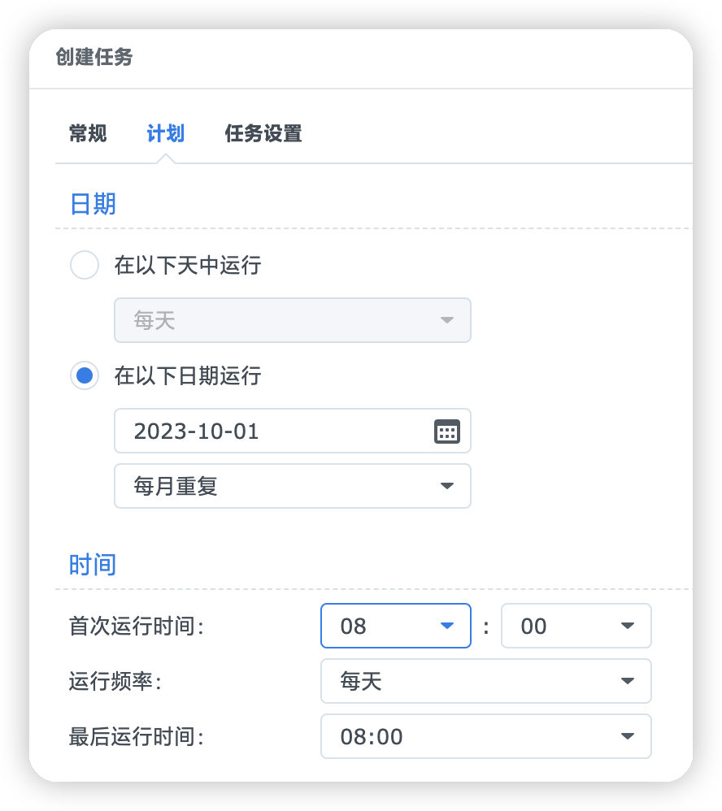

# AutoBangumi-OneClickScrip
一键部署自动追番、控制容器启动顺序及脚本快速更新容器，主要解决开机后qbittorrent启动慢导致AutoBangumi无法访问qbittorrent的问题，项目搭建于群晖，其他平台请根据自身情况修改。

# 依赖
- [Docker Compose](https://github.com/docker/compose)
- [AutoBangumi](https://github.com/EstrellaXD/Auto_Bangumi)
- [qbittorrent](https://registry.hub.docker.com/r/johngong/qbittorrent/)

# 搭建流程
## 群晖DSM7.2
群晖套件中心安装`Container Manager`套件
> 注意！！！
> 
> 群晖的Container Manager面板并不会显示我们通过命令行手动创建的项目，如果你通过面板创建了项目，甚至会和命令行产生冲突，提示此容器已创建，ID为xxxxx等，命令行也无法控制面板创建的项目，比如停止项目，移除项目等，一切操作必须通过面板执行
> 
> 你可以通过`/volume1/@appstore/ContainerManager/tool/synouserdata_docker`来查看当前用户管理的项目数量和web管理的项目数量，目前还没有办法解决此问题
> 
> 所以最好直接通过命令行来进行管理

## 群晖DSM7.1及以下版本
### 安装Docker套件
群晖套件中心安装`Docker`套件

### 安装Docker Compose
1. 打开群晖`控制面板`>`终端机和SNMP`，勾上`启动SSH功能`的勾，然后点击`应用`
2. 使用SSH客户端连接群晖
3. 使用`sudo -i`切换到root用户
4. 安装Docker Compose：
    ```bash
    curl -L "https://github.com/docker/compose/releases/latest/download/docker-compose-$(uname -s)-$(uname -m)" -o /usr/local/bin/docker-compose
    ```

5. 确保给予该二进制文件执行权限：
    ```bash
    chmod +x /usr/local/bin/docker-compose
    ```

6. 运行以下命令来验证 Docker Compose 是否成功安装：
    ```bash
    docker-compose --version
    ```

7.  将 `/usr/local/bin` 添加到你的系统环境变量中，以便你可以在任何位置运行 `docker-compose` 命令，而不仅仅是在 `/usr/local/bin 中`:
    ```bash
    ln -s /usr/local/bin/docker-compose /usr/bin/docker-compose
    ```

## 部署AutoBangumi
使用SSH命令行连接群晖后，输入如下命令一键部署AutoBangumi服务：
```bash
sudo mkdir -p /volume1/docker/Bangumi && cd /volume1/docker/Bangumi && wget https://github.com/AUKcl/AutoBangumi-OneClickScrip/raw/main/Scrip/OneClickScrip.sh && chmod +x OneClickScrip.sh && ./OneClickScrip.sh
```

1. 添加开机脚本，打开群晖`控制面板`>`任务计划`>`新增`>`触发的任务`>`用户自定义的脚本`：
   
   
2. 添加关机脚本，和开机脚本步骤一致，仅仅是事件改为关机，用户自定义的脚本如下：
   ```bash
   cd /volume1/docker/Bangumi && docker-compose -f compose.yaml stop
   ```

## 设置compose.yaml的容器定时更新
1. 添加定时更新脚本，和前面添加开关机脚本基本一致，`触发的任务`改为`计划的任务`,选项多了一个`计划`，示例如下：


2. 用户自定义的脚本内容如下：
    ```bash
    cd /volume1/docker/Bangumi && ./update_autobangumi_containers.sh
    ```

# End
部署和控制到此结束，至于qbittorrent和AutoBangumi怎么使用我就不赘述了，具体可以查看官方文档；

# 许可证
GPLv3 © [AUKcl](LICENSE)